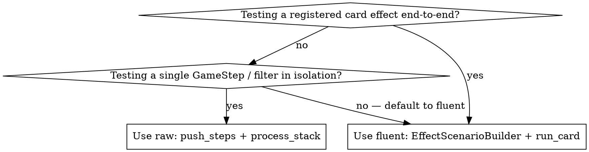

# GoA2 Card Effect Test Patterns

## Overview

GoA2 has two complementary test styles. Use the right one for the job:

- **Fluent effect tests** (preferred for card effects). Live in `tests/engine/effects/cases/test_HERO_effects.py`. Use `EffectScenarioBuilder` + `run_card()` to drive a registered card from the action chooser through to resolution.
- **Raw-stack step tests** (for testing individual steps in isolation). Live in dedicated files like `tests/engine/xargatha/test_retrieve_cards.py`. Use `push_steps` + `process_stack` directly, no card resolution wrapper.

**Core rule:** Always copy patterns from existing tests in `tests/engine/effects/cases/` (fluent) or `tests/engine/` (raw) rather than guessing constructor arguments.

## Preferred: Fluent Effect Tests

For any card effect that's already registered in a hero's deck, use the fluent pattern. Source files:

- Builder: `tests/engine/effects/builders.py` — `EffectScenarioBuilder`, `hero_card`, `card_for_effect`, `skill_card`, `movement_card`
- Runner: `tests/engine/effects/runner.py` — `run_card`, `EffectRun`
- Cases: `tests/engine/effects/cases/test_HERO_effects.py` (one file per hero)

### Minimal example

```python
import pytest

from goa2.domain.events import GameEventType
from goa2.domain.hex import Hex
from goa2.domain.input import InputRequestType

from ..builders import EffectScenarioBuilder, hero_card
from ..runner import run_card


@pytest.mark.effect_flow
def test_my_card_attacks_adjacent_enemy() -> None:
    state = (
        EffectScenarioBuilder()
        .with_hexes([(0, 0, 0), (1, 0, -1)])
        .red_hero(
            "hero_mortimer",
            at=(0, 0, 0),
            current_card=hero_card("Mortimer", "knife_of_the_living_dead"),
        )
        .blue_minion("blue_minion", at=(1, 0, -1))
        .with_actor("hero_mortimer")
        .build()
    )

    run = run_card(state, "hero_mortimer")
    run.expect_input(InputRequestType.CHOOSE_ACTION)
    run.choose("ATTACK").expect_input(InputRequestType.SELECT_UNIT)
    run.choose("blue_minion").expect_input(InputRequestType.SELECT_NUMBER)
    run.skip().finish()

    combat_events = [e for e in run.events if e.event_type == GameEventType.COMBAT_RESOLVED]
    assert combat_events
```

### EffectScenarioBuilder API

| Method | Purpose |
|---|---|
| `.with_hexes([(q, r, s), ...])` | Define the playable board hexes |
| `.line_board(length=6)` / `.small_arena()` | Quick preset boards |
| `.spawn_point(at, *, team, spawn_type)` | Mark a hex as a spawn point |
| `.red_hero(id, *, at, current_card=...)` / `.blue_hero(...)` | Add a hero with a card on the action queue |
| `.hero(id, *, team, at, current_card=...)` | Same, with explicit team |
| `.red_minion(id, *, at)` / `.blue_minion(...)` / `.minion(...)` | Add a minion |
| `.with_actor(hero_id)` | Set `state.current_actor_id` |
| `.with_card(hero_id, card_or_id)` | Replace the hero's `current_turn_card` after construction |
| `.with_unresolved_heroes([...])` | Override the unresolved-hero list |
| `.build()` | Finalize and return `GameState` |

### Getting a real card: `hero_card`

`hero_card("Mortimer", "knife_of_the_living_dead")` returns a fresh playable copy of the registered card from `HeroRegistry`. Use this whenever you need the card a hero will actually play. Do **not** hand-construct `Card(...)` for cards that already exist in a hero deck — you'll drift from the real stat block.

For test-only cards that aren't in any hero's deck, use the `skill_card` / `movement_card` factories from `builders.py`, or fall back to the validator-safe templates in the next section.

### EffectRun (returned by `run_card`)

| Method | Purpose |
|---|---|
| `run.expect_input(InputRequestType.X)` | Advance the stack and assert next request type |
| `run.choose(value)` | Provide `{"selection": value}` to the waiting step |
| `run.skip()` | Shorthand for `choose("SKIP")` |
| `run.confirm()` | Shorthand for `choose("YES")` |
| `run.finish()` | Drain the stack and assert no further input is requested |
| `run.latest_request` | The pending `InputRequest` (inspect prompt/options) |
| `run.events` | All `GameEvent`s emitted across the run |

`run.choose(...)` returns `self`, so chaining is the norm: `run.choose("ATTACK").expect_input(...)`.

### Pytest markers (registered in `pyproject.toml`)

- `@pytest.mark.effect_flow` — integration-level effect tests that drive a card to completion
- `@pytest.mark.effect_contract` — fast, narrow checks (e.g. "this effect registers as a passive")

### Conventional helpers

Each `tests/engine/effects/cases/test_HERO_effects.py` defines small file-local helpers for inspecting the current request. The Mortimer file is a good template:

```python
def _option_set(run) -> set:
    """Set of selectable values from the current request (raw metadata or option id)."""
    assert run.latest_request is not None
    options = set()
    for option in run.latest_request.options:
        if hasattr(option, "metadata") and option.metadata and "raw" in option.metadata:
            options.add(option.metadata.get("raw"))
        elif hasattr(option, "id"):
            options.add(option.id)
        else:
            options.add(option)
    return options


def _option_texts(run) -> list[str]:
    """Display text for each option in the current request, in order."""
    assert run.latest_request is not None
    return [option.text for option in run.latest_request.options]
```

`_option_set` is especially handy for `SELECT_HEX` requests because hex options expose the raw `Hex` in `option.metadata["raw"]`.

For hero-specific board state (e.g. Mortimer's zombie token pool), define a small `_add_X_pool(state)` helper at the top of the test file. Don't generalize prematurely.

## Fallback: Raw-Stack Step Tests

When you're testing a single step (or a small composition of steps) and the card-resolution wrapper would just be noise, drive the stack directly. Used by, e.g., `tests/engine/xargatha/test_retrieve_cards.py` for `RetrieveCardStep`, `CountStep`, `CheckContextConditionStep`.

```python
from goa2.engine.handler import process_stack, push_steps
from goa2.engine.steps import RetrieveCardStep

push_steps(state, [RetrieveCardStep(card_key="card_sel")])
result = process_stack(state)
assert result.input_request is None
assert len(hero.discard_pile) == 1
```

To answer an input request mid-stack:

```python
result = process_stack(state)
assert result.input_request is not None
assert result.input_request.request_type.value == "SELECT_CARD"

state.execution_stack[-1].pending_input = {"selection": "card_a"}
result = process_stack(state)
```

`process_stack` returns a `StackResult` with `.input_request` and `.events`. The legacy `process_resolution_stack` returns a dict and is still around in older tests; new code should prefer `process_stack`.

## Card Model Validators (Traps)

The `Card` model in `src/goa2/domain/models/card.py` rejects common guesses. These bite when hand-constructing test cards:

| Rule | What Fails | Fix |
|---|---|---|
| Range XOR Radius | `range_value=3, radius_value=2` | Set only one. `range_value` for ranged, `radius_value` for AoE |
| SKILL has no value | `primary_action=SKILL, primary_action_value=0` | Omit `primary_action_value` for SKILL cards |
| Non-SKILL needs value | `primary_action=ATTACK` without `primary_action_value` | Always set `primary_action_value` for ATTACK / MOVEMENT |
| Gold/Silver = UNTIERED | `color=GOLD, tier=CardTier.I` | Gold/Silver must use `tier=CardTier.UNTIERED` |
| Tiered = colored | `color=CardColor.RED, tier=CardTier.UNTIERED` | RED/BLUE/GREEN/PURPLE must have tier I-IV |

### Validator-safe templates

Only needed when the card you want isn't already registered. For registered cards, use `hero_card("Hero", "card_id")`.

```python
def _make_attack_card(card_id, name, effect_id, **overrides):
    defaults = dict(
        id=card_id, name=name, tier=CardTier.III, color=CardColor.RED,
        initiative=5, primary_action=ActionType.ATTACK, secondary_actions={},
        is_ranged=True, range_value=3, primary_action_value=4,
        effect_id=effect_id, effect_text="", is_facedown=False,
    )
    defaults.update(overrides)
    return Card(**defaults)


def _make_skill_card(card_id, name, effect_id, **overrides):
    defaults = dict(
        id=card_id, name=name, tier=CardTier.I, color=CardColor.GREEN,
        initiative=3, primary_action=ActionType.SKILL, secondary_actions={},
        is_ranged=False, radius_value=2,
        effect_id=effect_id, effect_text="", is_facedown=False,
    )
    defaults.update(overrides)
    return Card(**defaults)


def _make_filler_card(card_id="filler", color=CardColor.GOLD):
    return Card(
        id=card_id, name="Filler", tier=CardTier.UNTIERED, color=color,
        initiative=1, primary_action=ActionType.ATTACK, secondary_actions={},
        is_ranged=False, range_value=0, primary_action_value=1,
        effect_id="filler", effect_text="", is_facedown=False,
    )
```

## GameState Construction (raw)

If you bypass `EffectScenarioBuilder`, `GameState` requires `teams` at construction time:

```python
state = GameState(
    board=board,
    teams={
        TeamColor.RED: Team(color=TeamColor.RED, heroes=[hero], minions=[minion]),
        TeamColor.BLUE: Team(color=TeamColor.BLUE, heroes=[enemy], minions=[]),
    },
)
state.place_entity("brogan", Hex(q=0, r=0, s=0))
state.place_entity("enemy", Hex(q=2, r=0, s=-2))
```

### Adding entities mid-test

```python
minion2 = Minion(id="minion_2", name="Minion 2", team=TeamColor.RED, type=MinionType.MELEE)
state.teams[TeamColor.RED].minions.append(minion2)
state.place_entity("minion_2", Hex(q=1, r=1, s=-2))
```

`place_entity` handles registration — no separate `register_all_entities()` call needed.

For mid-test repositioning: `state.move_unit(UnitID("minion_1"), Hex(q=3, r=0, s=-3))`.

### Discard pile setup

For tests that exercise card retrieval, just assign `hero.discard_pile` after the build:

```python
mortimer = state.get_hero("hero_mortimer")
discarded = hero_card("Mortimer", "stage_dive")
mortimer.discard_pile = [discarded]
```

## Other Model Quirks

### Minion.value is computed

```python
# CORRECT
Minion(id="m1", name="M", team=TeamColor.RED, type=MinionType.MELEE)
# m.value == 2 (computed)
```

MELEE/RANGED = 2, HEAVY = 4. Don't pass `value=` to the constructor.

### InputOption uses `text`, not `label`

```python
InputOption(id="opt1", text="Choose this")
```

### create_input_request signature

```python
create_input_request(
    request_type=InputRequestType.SELECT_CARD,  # NOT input_type, NOT type
    player_id="hero_id",
    prompt="Choose something",
    options=[...],
    can_skip=True,
)
```

## Common Assertion Patterns

```python
# Position
assert state.entity_locations.get("unit_id") is not None
assert state.entity_locations.get("unit_id") is None  # was removed

# Hand / discard
hero = state.get_hero("hero_id")
assert len(hero.hand) == 1
assert discarded in hero.hand
assert discarded not in hero.discard_pile

# Gold
assert hero.gold == expected_amount

# Effects
assert any(e.effect_type == EffectType.X for e in state.active_effects)

# Events
assert any(e.event_type == GameEventType.CARD_RETRIEVED for e in run.events)
combat_events = [e for e in run.events if e.event_type == GameEventType.COMBAT_RESOLVED]
assert combat_events[-1].metadata["attack_value"] == 7
```

## Test File Layout

| Style | Location | Naming |
|---|---|---|
| Fluent effect tests | `tests/engine/effects/cases/` | `test_HERO_effects.py` (one per hero) |
| Raw step tests | `tests/engine/<topic>/` or `tests/engine/` | `test_FEATURE.py` |

Test files must have unique basenames across all `tests/` subdirectories (no `__init__.py` in test dirs).

## Choosing Between the Two Styles



When in doubt, mirror the closest existing test for the hero or step you're working on.
