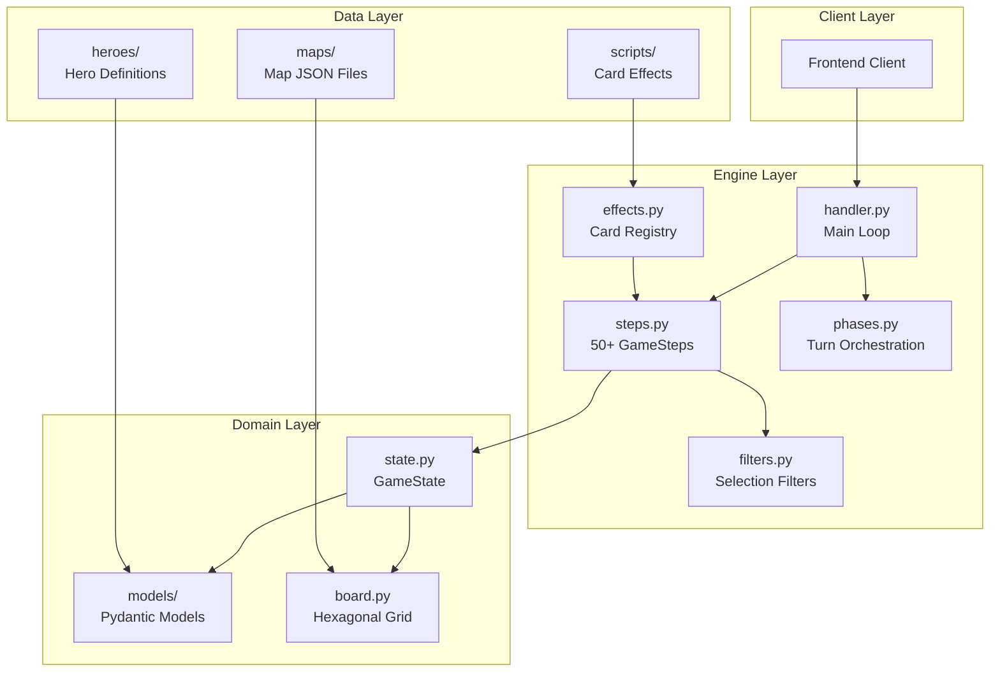
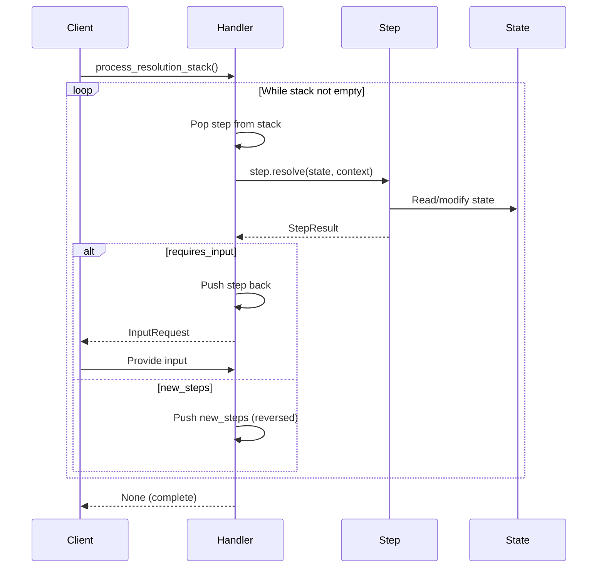
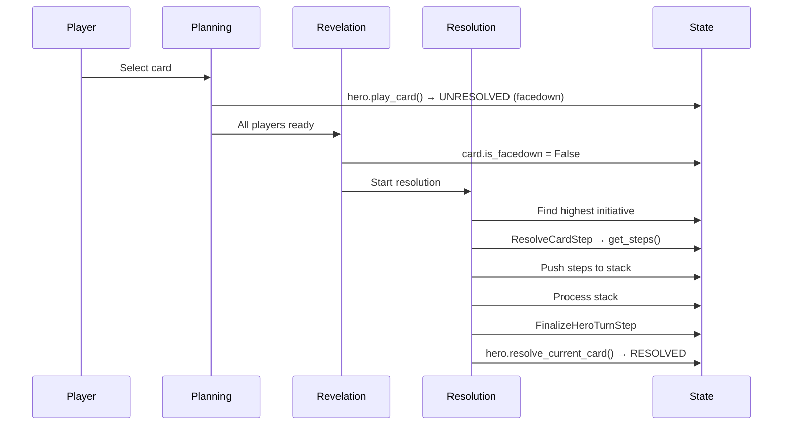
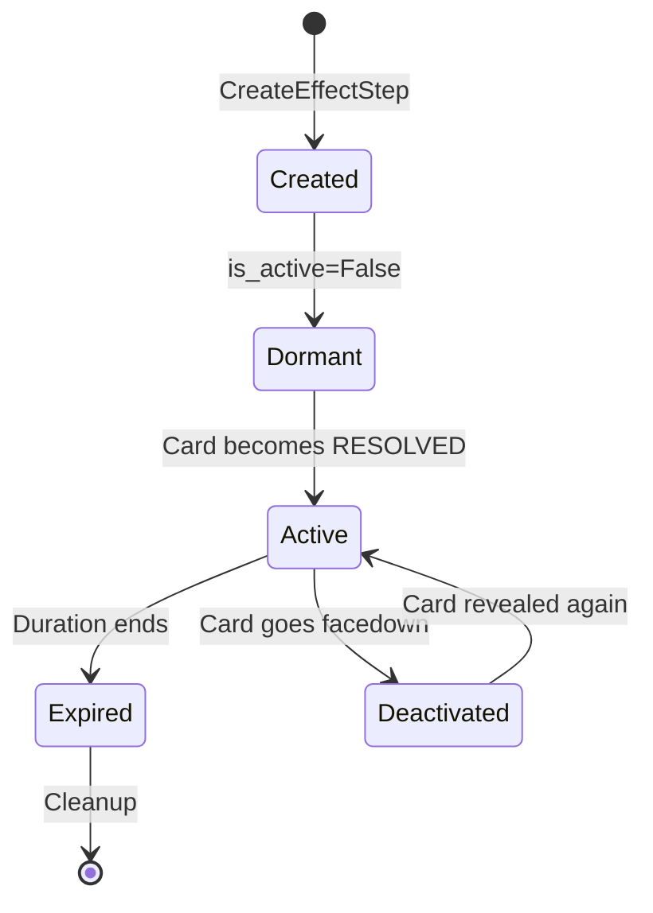

# Codebase Map

> Auto-generated by Cartographer. Last mapped: 2026-01-15

## System Overview

Guards of Atlantis II (GoA2) is a **deterministic, stack-based game engine** for a tactical hexagonal board game. The architecture follows a "Logic as Data" philosophy where game actions are atomic steps on a LIFO execution stack, enabling pauseable mid-action gameplay with input requests.



## Directory Structure

```
src/goa2/
├── domain/                 # Data models (Pydantic V2)
│   ├── models/             # Entity definitions
│   │   ├── base.py         # GameEntity, BoardEntity base classes
│   │   ├── card.py         # Card with hidden info masking
│   │   ├── effect.py       # ActiveEffect, EffectScope
│   │   ├── enums.py        # 15+ game enums
│   │   ├── marker.py       # Singleton markers (Venom, etc.)
│   │   ├── spawn.py        # SpawnPoint definitions
│   │   ├── team.py         # Team container
│   │   ├── token.py        # Non-unit board entities
│   │   └── unit.py         # Hero, Minion classes
│   ├── state.py            # GameState - single source of truth
│   ├── board.py            # Board, Zone, Tile
│   ├── hex.py              # Cube coordinate system
│   ├── input.py            # InputRequest types
│   ├── factory.py          # EntityFactory for ID generation
│   └── types.py            # NewType aliases
├── engine/                 # Game logic
│   ├── handler.py          # process_resolution_stack() main loop
│   ├── steps.py            # 50+ GameStep subclasses
│   ├── filters.py          # 20+ FilterCondition subclasses
│   ├── effects.py          # CardEffect base + registry
│   ├── effect_manager.py   # Effect lifecycle management
│   ├── validation.py       # ValidationService for action legality
│   ├── phases.py           # Turn/phase orchestration
│   ├── rules.py            # Pathfinding, immunity checks
│   ├── stats.py            # Modifier calculations
│   ├── map_loader.py       # JSON map parsing
│   ├── map_logic.py        # Lane push mechanics
│   └── setup.py            # Game initialization
├── data/
│   ├── heroes/             # Hero definitions
│   │   ├── arien.py        # Water mage (17 cards)
│   │   ├── knight.py       # Melee tank (3 cards)
│   │   ├── rogue.py        # Assassin (5 cards)
│   │   ├── wasp.py         # Telekinetic (18 cards)
│   │   ├── xargatha.py     # Gorgon (16 cards)
│   │   └── registry.py     # HeroRegistry singleton
│   └── maps/
│       └── forgotten_island.json  # Default map
└── scripts/                # Card effect implementations
    ├── arien_effects.py    # 17 Arien card effects
    ├── rogue_effects.py    # 4 Rogue card effects
    ├── wasp_effects.py     # 1 Wasp card effect
    └── demo_step_engine.py # Interactive demo
```

## Module Guide

### Domain Layer (`src/goa2/domain/`)

#### state.py - GameState
**Purpose**: Single source of truth for all mutable game state.

**Key Fields**:
| Field | Type | Purpose |
|-------|------|---------|
| `execution_stack` | `List[GameStep]` | LIFO action queue |
| `execution_context` | `Dict[str, Any]` | Transient step-to-step data |
| `entity_locations` | `Dict[BoardEntityID, Hex]` | Authoritative positions |
| `active_effects` | `List[ActiveEffect]` | Spatial/behavioral effects |
| `markers` | `Dict[MarkerType, Marker]` | Singleton markers |
| `teams` | `Dict[TeamColor, Team]` | Team data + life counters |
| `board` | `Board` | Static map structure |

**Key Methods**:
- `place_entity(id, hex)` - Updates location + tile cache
- `remove_entity(id)` - Clears from both systems
- `get_unit(id)` / `get_hero(id)` - O(N) lookups
- `create_entity_id(prefix)` - Unique ID generation

**Gotchas**:
- Never modify `tile.occupant_id` directly - use `place_entity()`
- `execution_context` cleared each turn
- `entity_locations` and `tile.occupant_id` must stay in sync

---

#### hex.py - Hexagonal Coordinates
**Purpose**: Cube coordinate system for hexagonal grid.

**Exports**: `Hex` (frozen Pydantic model), `HexDirection` (6 directions)

**Key Methods**:
- `distance(other)` - Manhattan distance
- `neighbors()` - 6 adjacent hexes
- `ring(radius)` - Hexes at exact distance
- `line_to(other)` - Path between straight-line hexes

**Pattern**: Frozen model enables dict key usage and immutability.

---

#### models/card.py - Card
**Purpose**: Card definition with hidden info masking.

**Masked Properties**: `current_tier`, `current_color`, `current_primary_action` etc. return `None` when `is_facedown=True`.

**Validators** (9 total):
- Range and Radius mutually exclusive
- Tier-Color pairing rules (Gold/Silver=UNTIERED, Purple=IV)
- HOLD always in secondaries
- Primary action validation

---

#### models/unit.py - Hero, Minion
**Purpose**: Playable characters and spawned creatures.

**Hero Card Management**:
- `play_card(card)` - Hand → Unresolved (facedown)
- `resolve_current_card()` - Unresolved → Resolved
- `retrieve_cards()` - End of round return to hand
- `swap_cards(a, b)` - Position AND state swap

---

#### models/effect.py - ActiveEffect
**Purpose**: Spatial effects with scope and duration.

**EffectScope**: `shape` + `range` + `origin` + `affects` filter

**Effect Types**:
- `PLACEMENT_PREVENTION` - Magnetic Dagger
- `MOVEMENT_ZONE` - Slippery Ground
- `TARGET_PREVENTION` - Smoke Bomb
- `ATTACK_IMMUNITY` - Expert Duelist

---

### Engine Layer (`src/goa2/engine/`)

#### handler.py - Main Loop
**Purpose**: LIFO stack processor with pause/resume.

```python
def process_resolution_stack(state):
    while stack not empty:
        step = pop()
        result = step.resolve(state, context)
        if result.requires_input:
            push back, return InputRequest
        if result.new_steps:
            push_steps(state, result.new_steps)
```

**Key Behavior**:
- Steps are popped BEFORE execution
- `abort_action=True` clears to `FinalizeHeroTurnStep`
- Safety counter prevents infinite loops (MAX_STEPS=1000)

---

#### steps.py - 50+ GameStep Subclasses
**Purpose**: Atomic game operations.

**Categories**:

| Category | Examples | Purpose |
|----------|----------|---------|
| Selection | `SelectStep` | Player input with filters |
| Movement | `MoveUnitStep`, `PushUnitStep`, `PlaceUnitStep` | Position changes |
| Combat | `AttackSequenceStep`, `ResolveCombatStep`, `DamageStep` | Damage resolution |
| Reactions | `ReactionWindowStep`, `ResolveDefenseTextStep` | Mid-action interrupts |
| Cards | `DrawCardStep`, `DiscardCardStep`, `SwapCardStep` | Card management |
| Effects | `CreateEffectStep`, `PlaceMarkerStep` | Buff/debuff application |
| Passives | `CheckPassiveAbilitiesStep`, `OfferPassiveStep` | Passive triggers |
| Control | `FindNextActorStep`, `FinalizeHeroTurnStep` | Turn management |

**Key Patterns**:
- `is_mandatory=True` (default) - Failure aborts action
- `active_if_key` - Conditional execution based on context
- `pending_input` - Client provides input to continue

---

#### filters.py - Selection Filters
**Purpose**: Composable predicates for unit/hex selection.

**Common Filters**:
| Filter | Purpose |
|--------|---------|
| `TeamFilter` | FRIENDLY/ENEMY/SELF relation |
| `RangeFilter` | Distance check |
| `UnitTypeFilter` | HERO vs MINION |
| `ImmunityFilter` | Auto-added for UNIT targets |
| `MovementPathFilter` | BFS pathfinding validation |
| `LineBehindTargetFilter` | Backstab targeting |

**Pattern**: `SelectStep` with `target_type="UNIT"` auto-adds `ImmunityFilter`.

---

#### effects.py - Card Effect Registry
**Purpose**: Plugin architecture for card logic.

```python
@register_effect("liquid_leap")
class LiquidLeapEffect(CardEffect):
    def get_steps(self, state, hero, card) -> List[GameStep]: ...
    def get_defense_steps(self, state, hero, card, context): ...
    def get_passive_config(self) -> PassiveConfig: ...
```

---

#### validation.py - ValidationService
**Purpose**: Action legality checking.

**Methods**:
- `can_perform_action()` - Action restrictions
- `can_be_targeted()` - LOS blockers, invisibility
- `can_move()` - Movement caps
- `can_be_placed()` - Placement prevention

---

#### stats.py - Stat Calculation
**Purpose**: Layered stat computation.

**Formula**: `Base + Items + AREA_STAT_MODIFIER effects + Markers`

---

### Data Layer (`src/goa2/data/`)

#### heroes/ - Hero Definitions
**Pattern**: Factory functions creating Hero instances with cards.

| Hero | Theme | Cards |
|------|-------|-------|
| Arien | Water mage, positioning | 17 + ultimate |
| Knight | Melee tank | 3 |
| Rogue | Assassin, sabotage | 5 |
| Wasp | Telekinetic, defense | 18 |
| Xargatha | Gorgon, crowd control | 16 |

#### scripts/ - Card Effects
**Arien Effects** (17):
- Movement: `liquid_leap`, `magical_current`, `stranger_tide`
- Combat: `noble_blade`, `dangerous_current`, `raging_stream`, `violent_torrent`
- Swap: `arcane_whirlpool`, `ebb_and_flow`
- Push: `rogue_wave`, `tidal_blast`
- Zones: `slippery_ground`, `deluge`
- Defense: `aspiring_duelist`, `expert_duelist`, `master_duelist`
- Passive: `living_tsunami` (ultimate)

---

## Data Flow

### Step Execution Flow



### Card Play Flow



### Effect Lifecycle



---

## Conventions

### Naming
- Steps: `<Action>Step` (e.g., `MoveUnitStep`, `AttackSequenceStep`)
- Filters: `<Criteria>Filter` (e.g., `TeamFilter`, `RangeFilter`)
- Effects: `<card_name>` lowercase with underscores (e.g., `liquid_leap`)

### ID Patterns
- Heroes: `hero_<name>` (static)
- Minions: `minion_<N>` (dynamic via `create_entity_id`)
- Cards: `<card_name>` matching effect_id

### Step Result Patterns
```python
# Finished, no side effects
return StepResult(is_finished=True)

# Spawns new steps
return StepResult(is_finished=True, new_steps=[Step1(), Step2()])

# Needs input
return StepResult(is_finished=False, requires_input=True, input_request={...})

# Abort action chain
return StepResult(is_finished=True, abort_action=True)
```

---

## Gotchas

### Critical Rules
1. **Never modify `board.tiles` directly** - Use `state.place_entity()`
2. **Never read stats directly** - Use `stats.get_computed_stat()`
3. **Never modify stack in resolve()** - Return `StepResult(new_steps=[...])`
4. **Context is transient** - Cleared in `FinalizeHeroTurnStep`
5. **Steps pop BEFORE execute** - Re-push for continuation

### Hidden Information
- `card.current_*` properties respect `is_facedown`
- HOLD is always visible even when facedown
- PASSIVE effects bypass `is_active` checks

### Auto-Behaviors
- `SelectStep` auto-adds `ImmunityFilter` for `target_type="UNIT"`
- `RangeFilter` defaults origin to `state.current_actor_id`
- MOVEMENT cards auto-get FAST_TRAVEL secondary
- ATTACK cards auto-get CLEAR secondary

---

## Navigation Guide

**To add a new hero**:
1. Create `src/goa2/data/heroes/<hero>.py`
2. Define cards with `Card(...)`
3. Register with `HeroRegistry.register()`
4. Import in `src/goa2/data/heroes/__init__.py`

**To add a card effect**:
1. Create class in `src/goa2/scripts/<hero>_effects.py`
2. Decorate with `@register_effect("effect_id")`
3. Link card to effect via `effect_id` field

**To add a filter**:
1. Subclass `FilterCondition` in `src/goa2/engine/filters.py`
2. Implement `apply(candidate, state, context) -> bool`

**To add a game step**:
1. Subclass `GameStep` in `src/goa2/engine/steps.py`
2. Implement `resolve(state, context) -> StepResult`
3. Add to `StepType` enum if needed

**To test a mechanic**:
1. Create `tests/engine/test_<mechanic>.py`
2. Use fixtures from existing tests
3. Follow stack-based testing pattern:
   - Push steps
   - Process stack
   - Assert state or provide input
   - Continue processing

---

## Testing Quick Reference

```bash
# All tests with coverage
PYTHONPATH=src uv run pytest --cov=goa2 tests/

# Single file
PYTHONPATH=src uv run pytest tests/engine/test_steps.py

# Single function
PYTHONPATH=src uv run pytest tests/engine/test_steps.py::test_name -v

# Interactive demo
PYTHONPATH=src uv run python -m goa2.scripts.demo_step_engine
```

### Test Pattern
```python
def test_mechanic(empty_state):
    # Setup
    push_steps(empty_state, [SomeStep(...)])

    # Execute
    req = process_resolution_stack(empty_state)

    # Assert input request
    assert req["type"] == "SELECT_UNIT"

    # Provide input
    empty_state.execution_stack[-1].pending_input = {"selection": "target"}

    # Continue
    req = process_resolution_stack(empty_state)
    assert req is None

    # Assert final state
    assert empty_state.execution_context["result"] == expected
```
