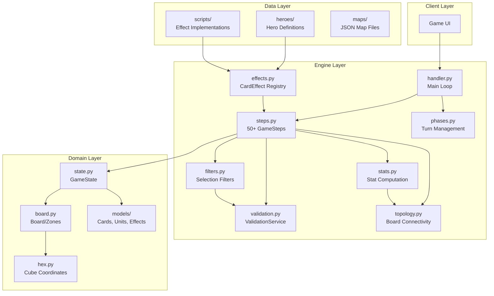
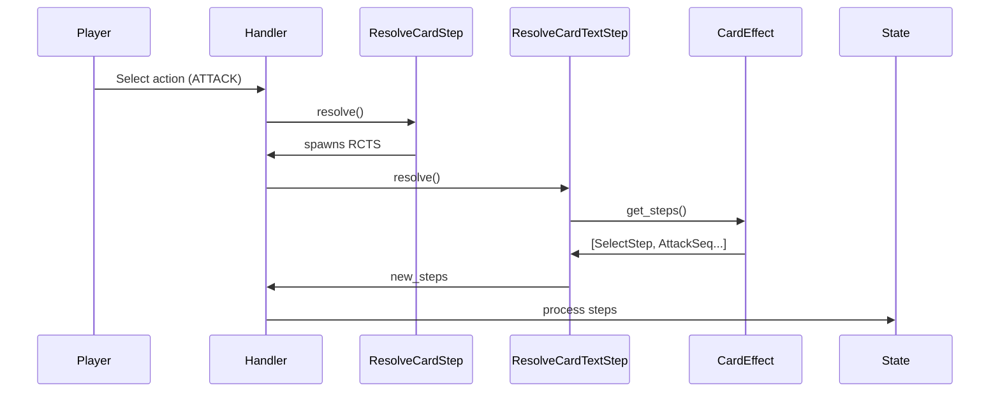
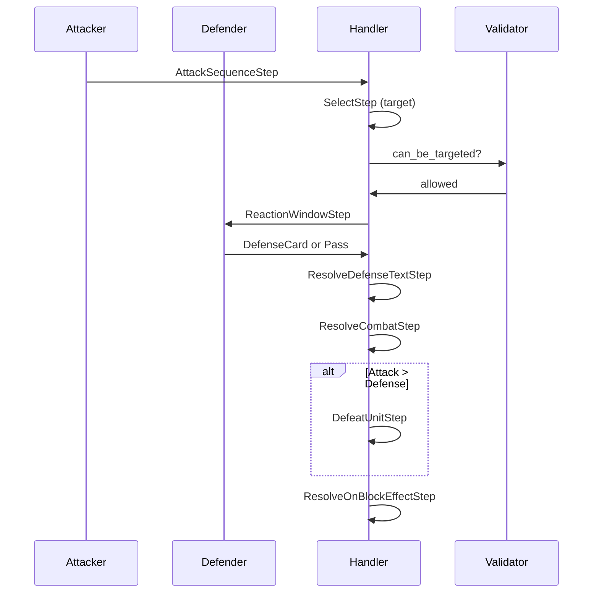
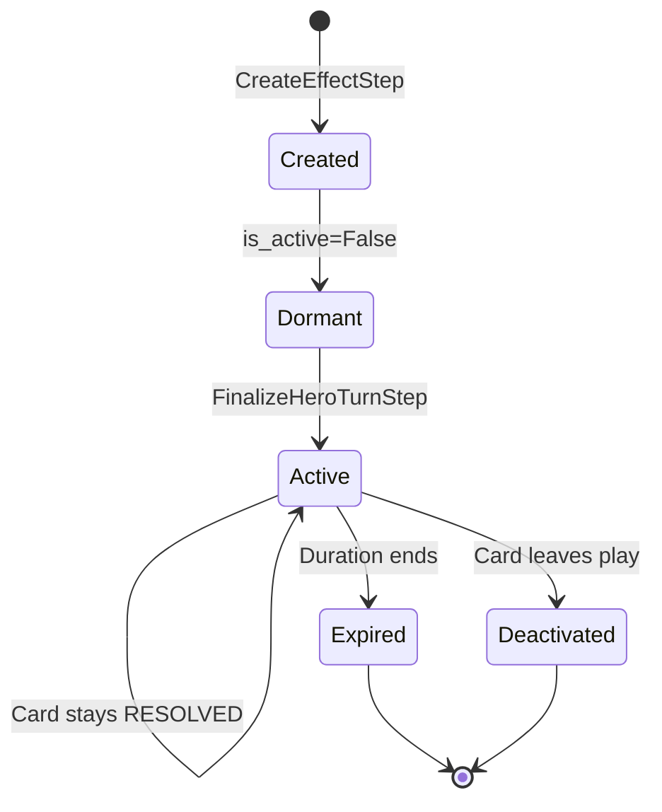

# Codebase Map

> Auto-generated by Cartographer. Last mapped: 2026-02-05

## System Overview

Guards of Atlantis II (GoA2) backend - a deterministic, stack-based game engine for a hexagonal tactical board game. Built with Python 3.11+ and Pydantic V2.

**Core Philosophy:** "Logic as Data" - uses atomic game steps pushed onto a LIFO execution stack instead of nested function calls, enabling pauseable mid-action gameplay with input requests.



## Directory Structure

```
src/goa2/
├── domain/                 # Data models (Pydantic V2)
│   ├── models/             # Game entities
│   │   ├── card.py         # Card with hidden info masking
│   │   ├── unit.py         # Hero and Minion classes
│   │   ├── effect.py       # ActiveEffect and scopes
│   │   ├── enums.py        # All game enumerations
│   │   ├── marker.py       # Singleton marker tokens
│   │   ├── spawn.py        # Spawn point definitions
│   │   └── team.py         # Team container
│   ├── state.py            # GameState - single source of truth
│   ├── board.py            # Board, Zones, spatial queries
│   ├── hex.py              # Hexagonal cube coordinates
│   ├── tile.py             # Individual board locations
│   ├── input.py            # Player input requests
│   └── factory.py          # Entity creation with unique IDs
├── engine/
│   ├── handler.py          # process_resolution_stack() loop
│   ├── steps.py            # 50+ GameStep subclasses (~3700 lines)
│   ├── phases.py           # Turn/phase orchestration
│   ├── rules.py            # Pathfinding, targeting, immunity
│   ├── stats.py            # Modifier calculations
│   ├── effects.py          # CardEffect base + registry
│   ├── effect_manager.py   # Effect lifecycle management
│   ├── filters.py          # Composable selection filters
│   ├── validation.py       # Centralized validation service
│   ├── topology.py         # Board connectivity (reality splits)
│   ├── setup.py            # Game initialization
│   ├── map_loader.py       # JSON map parsing
│   └── map_logic.py        # Lane push mechanics
├── data/
│   ├── heroes/             # Hero definitions
│   │   ├── arien.py        # "The Tidemaster" - 14 cards
│   │   ├── wasp.py         # "The Warmaiden" - 17 cards
│   │   ├── xargatha.py     # "The Changed" - 16 cards
│   │   ├── knight.py       # Test hero - 3 cards
│   │   ├── rogue.py        # Test hero - 5 cards
│   │   └── registry.py     # HeroRegistry singleton
│   └── maps/
│       └── forgotten_island.json  # Default map
├── scripts/                # Card effect implementations
│   ├── arien_effects.py    # 15 effects for Arien
│   ├── wasp_effects.py     # 20 effects for Wasp
│   ├── rogue_effects.py    # 3 effects for Rogue
│   └── demo_step_engine.py # Interactive demo
└── main.py                 # Entry point
tests/
├── domain/                 # Model and state tests
├── engine/                 # Step and mechanics tests
└── conftest.py             # Shared fixtures
```

## Module Guide

### Domain Layer (`src/goa2/domain/`)

#### state.py - GameState
**Purpose**: Central mutable game state - single source of truth

**Key Attributes**:
| Attribute | Type | Purpose |
|-----------|------|---------|
| `execution_stack` | `List[GameStep]` | LIFO action queue |
| `execution_context` | `Dict[str, Any]` | Transient inter-step data |
| `entity_locations` | `Dict[BoardEntityID, Hex]` | Authoritative position tracking |
| `active_effects` | `List[ActiveEffect]` | Temporary effects/modifiers |
| `markers` | `Dict[MarkerType, Marker]` | Singleton status markers |
| `teams` | `Dict[TeamColor, Team]` | Team containers with heroes/minions |
| `board` | `Board` | Static map data |

**Key Methods**:
- `place_entity(id, hex)` / `remove_entity(id)` - Position management
- `get_hero(id)` / `get_unit(id)` / `get_entity(id)` - Entity retrieval
- `create_entity_id(prefix)` - Unique ID generation
- `add_effect(effect)` - Effect registration
- `place_marker(type, target, value)` - Marker placement

**Patterns**:
- `entity_locations` is authoritative; `board.tiles` is a synced cache
- Pydantic `@model_validator` auto-rebuilds tile occupancy on load

---

#### hex.py - Hexagonal Coordinates
**Purpose**: Cube coordinate system with geometric operations

**Key Class**: `Hex(q, r, s)` - Frozen Pydantic model
- Invariant: `q + r + s == 0`
- Methods: `distance()`, `neighbor()`, `ring()`, `line_to()`, `is_straight_line()`
- Custom serialization for dict key usage

**Key Enum**: `HexDirection` (NE, E, SE, SW, W, NW)

---

#### board.py - Board Structure
**Purpose**: Static map container with spatial queries

**Key Classes**:
- `Zone` - Named hex collection with neighbors and spawn points
- `Board` - Holds zones, tiles, lane order, O(1) hex-to-zone lookup

---

#### models/card.py - Cards
**Purpose**: Hero ability cards with hidden information

**Key Features**:
- `current_*` properties return `None/0` when `is_facedown=True`
- Automatic secondary actions (HOLD always, FAST_TRAVEL for movement, CLEAR for attack)
- Tier/color validation (Gold=UNTIERED, Red/Blue/Green=I-III, Purple=IV)

---

#### models/unit.py - Units
**Purpose**: Heroes and minions

**Hero Key Features**:
- Card containers: `deck`, `hand`, `played_cards`, `current_turn_card`, `discard_pile`
- Card lifecycle: `play_card()`, `resolve_current_card()`, `discard_card()`, `retrieve_cards()`
- Progression: `level`, `gold`, `items`, `ultimate_card`

**Minion Types**: MELEE (2 gold), RANGED (2 gold), HEAVY (4 gold, immunity when supported)

---

#### models/effect.py - Active Effects
**Purpose**: Spatial and behavioral effect system

**Key Classes**:
- `ActiveEffect` - Full effect with scope, duration, restrictions
- `EffectScope` - Shape, range, origin, affects filter

**Effect Types**: `PLACEMENT_PREVENTION`, `MOVEMENT_ZONE`, `TARGET_PREVENTION`, `LOS_BLOCKER`, `AREA_STAT_MODIFIER`, `ATTACK_IMMUNITY`, `TOPOLOGY_SPLIT`, `TOPOLOGY_ISOLATION`, `STATIC_BARRIER`

**Duration Types**: `THIS_TURN`, `NEXT_TURN`, `THIS_ROUND`, `PASSIVE`

---

### Engine Layer (`src/goa2/engine/`)

#### handler.py - Main Loop
**Purpose**: Step execution orchestrator

**Key Function**: `process_resolution_stack(state)`
```
1. Pop step from execution_stack
2. Call step.resolve(state, context)
3. If requires_input: pause, return InputRequest
4. If abort_action: skip to FinalizeHeroTurnStep
5. If new_steps: push onto stack (reversed for LIFO)
6. Repeat until stack empty or game over
```

---

#### steps.py - Game Steps (~3700 lines, 50+ classes)
**Purpose**: Atomic game operations

**Base Classes**:
- `GameStep` - Abstract base with `resolve()` method
- `StepResult` - Return value with `is_finished`, `requires_input`, `new_steps`, `abort_action`

**Step Categories**:

| Category | Key Steps | Purpose |
|----------|-----------|---------|
| Selection | `SelectStep`, `MultiSelectStep` | Target selection with filters |
| Movement | `MoveUnitStep`, `PlaceUnitStep`, `PushUnitStep`, `SwapUnitsStep` | Unit positioning |
| Combat | `AttackSequenceStep`, `ResolveCombatStep`, `DefeatUnitStep` | Attack resolution |
| Reactions | `ReactionWindowStep`, `ResolveDefenseTextStep` | Defense card handling |
| Effects | `CreateEffectStep`, `CancelEffectsStep` | Effect lifecycle |
| Markers | `PlaceMarkerStep`, `RemoveMarkerStep` | Marker management |
| Passives | `CheckPassiveAbilitiesStep`, `OfferPassiveStep` | Passive ability triggers |
| Cards | `ResolveCardStep`, `ResolveCardTextStep`, `SwapCardStep` | Card resolution |
| Turns | `FinalizeHeroTurnStep`, `FindNextActorStep` | Turn management |
| Loops | `MayRepeatOnceStep`, `ForEachStep` | Iteration patterns |

**Mandatory vs Optional**:
- `is_mandatory=True`: Failure aborts action (skips to FinalizeHeroTurnStep)
- `is_mandatory=False`: Failure continues to next step

---

#### filters.py - Selection Filters
**Purpose**: Composable target validation

**Base Class**: `FilterCondition` with `apply(candidate, state, context) -> bool`

**Key Filters**:
| Filter | Purpose |
|--------|---------|
| `RangeFilter` | Distance validation (topology-aware) |
| `TeamFilter` | SELF/FRIENDLY/ENEMY relations |
| `UnitTypeFilter` | HERO vs MINION |
| `ImmunityFilter` | Heavy minion immunity + attack immunity effects |
| `ObstacleFilter` | Terrain/occupancy checks |
| `LineBehindTargetFilter` | Backstab targeting |
| `PreserveDistanceFilter` | Orbit movement (Wasp) |
| `NotInStraightLineFilter` | Diagonal-only targeting (Wasp) |

---

#### validation.py - ValidationService
**Purpose**: Centralized "can X do Y to Z?" validation

**Key Methods**:
- `can_perform_action(state, actor_id, action_type)` - Action restrictions
- `can_be_targeted(state, actor_id, target_id)` - LOS/immunity checks
- `can_be_placed(state, unit_id, actor_id, destination)` - Placement validation
- `can_be_moved/pushed/swapped(state, unit_id, actor_id)` - Displacement checks
- `is_obstacle_for_actor(state, hex, actor_id)` - Context-aware obstacles (Static Barrier)

**Returns**: `ValidationResult(allowed, reason, blocking_effect_ids)`

---

#### topology.py - TopologyService
**Purpose**: Board connectivity with reality splits (Nebkher)

**Region System**:
- NEGATIVE: axis < split_value
- ZERO: bridge region (connected to both)
- POSITIVE: axis > split_value

**Key Methods**:
- `distance(origin, target, state)` - Returns `inf` if disconnected
- `are_connected(a, b, state)` - Connectivity check
- `get_traversable_neighbors(hex, state)` - Pathfinding-valid neighbors
- `hex_in_scope(origin, target, shape, range, state)` - Scope validation

---

#### stats.py - Stat Calculation
**Purpose**: Computed stats with modifiers

**Formula**: `Base + Items + AREA_STAT_MODIFIER effects + Markers`

**Key Functions**:
- `get_computed_stat(state, unit_id, stat_type, base_value)`
- `calculate_minion_defense_modifier(state, target_unit_id)` - Aura bonuses
- `compute_card_stats(state, hero_id, card)` - Pre-computed CardStats

---

#### effects.py - Card Effect System
**Purpose**: Effect registration and step generation

**Key Classes**:
- `CardEffect` (ABC) - Base class with `build_steps()`, `build_defense_steps()`, `get_passive_config()`
- `CardEffectRegistry` - Global registry with `@register_effect(id)` decorator
- `PassiveConfig` - Trigger, uses_per_turn, is_optional

---

#### phases.py - Phase Management
**Purpose**: Turn cycle orchestration

**Key Functions**:
- `commit_card(state, hero_id, card)` - Planning phase card selection
- `start_revelation_phase(state)` - Reveal cards, set initiative
- `resolve_next_action(state)` - Dynamic initiative calculation
- `end_turn(state)` - Expire effects, check phase transition

---

### Data Layer (`src/goa2/data/`)

#### Hero Definition Pattern
```python
def create_hero_name() -> Hero:
    return Hero(
        id=HeroID("hero_name"),
        name="Display Name",
        title="Subtitle",
        deck=[Card(...), ...],
        ultimate_card=Card(tier=CardTier.IV, ...),
    )

HeroRegistry.register(create_hero_name())
```

#### Effect Implementation Pattern
```python
@register_effect("effect_id")
class MyEffect(CardEffect):
    def build_steps(self, state, hero, card, stats) -> List[GameStep]:
        return [
            SelectStep(target_type="UNIT", filters=[...]),
            AttackSequenceStep(damage=stats.primary_value, ...),
        ]

    def get_passive_config(self) -> Optional[PassiveConfig]:
        return PassiveConfig(trigger=PassiveTrigger.BEFORE_ATTACK, ...)
```

---

## Data Flow

### Card Resolution Flow



### Attack Sequence Flow



### Effect Lifecycle



---

## Conventions

### Naming
- Hero IDs: `hero_name` (lowercase, underscore)
- Card IDs: `hero_cardname` or `cardname`
- Effect IDs: `cardname` (matches card)
- Step classes: `VerbNounStep` (e.g., `PlaceUnitStep`)

### Context Keys
- `target_id`, `victim_id` - Selected entity IDs
- `destination_hex` - Selected position
- `attack_damage`, `defense_value` - Combat values
- `block_succeeded` - Boolean for on-block effects
- `auto_block`, `defense_invalid` - Defense card flags

### Error Handling
- Mandatory step failure: `abort_action=True`
- Optional step failure: Continue silently
- Invalid state: Log error, don't crash

---

## Gotchas

1. **entity_locations vs board.tiles**: Always use `entity_locations` for position truth. `board.tiles[hex].occupant_id` is a cache.

2. **Card masking**: Always use `card.current_*` properties to respect facedown state.

3. **Step order**: Steps pushed in reverse order for LIFO. `push_steps([A, B, C])` executes A first.

4. **Effect activation**: Effects created during card resolution are `is_active=False` until `FinalizeHeroTurnStep`.

5. **Topology**: Use `TopologyService` for all distance/adjacency checks. Never use raw `Hex.distance()` for game logic.

6. **Immunity**: Heavy minions are immune when another same-team minion exists in active zone.

7. **Mandatory steps**: If a mandatory step has no valid candidates, the entire action aborts.

8. **Context clearing**: `execution_context` is cleared after each hero's turn by `FinalizeHeroTurnStep`.

---

## Navigation Guide

**To add a new hero**:
1. Create `src/goa2/data/heroes/heroname.py` with hero definition
2. Create `src/goa2/scripts/heroname_effects.py` with card effects
3. Register effects with `@register_effect("effect_id")`
4. Add hero to `src/goa2/data/heroes/__init__.py`
5. Write tests in `tests/engine/test_heroname_*.py`

**To add a new card effect**:
1. Add effect class in `scripts/heroname_effects.py`
2. Use `@register_effect("card_id")` decorator
3. Implement `build_steps()` for primary action
4. Implement `build_defense_steps()` if it's a defense card
5. Implement `get_passive_config()` + `get_passive_steps()` for passives

**To add a new step type**:
1. Add StepType enum value in `domain/models/enums.py`
2. Create class in `engine/steps.py` extending `GameStep`
3. Implement `resolve(state, context) -> StepResult`
4. Write tests in `tests/engine/test_steps.py`

**To add a new filter**:
1. Create class in `engine/filters.py` extending `FilterCondition`
2. Add FilterType enum value
3. Implement `apply(candidate, state, context) -> bool`
4. Write tests in `tests/engine/test_filters.py`

**To modify game rules**:
1. Check `deterministic_rules.md` for authoritative rules
2. Update `engine/rules.py` for pathfinding/targeting
3. Update `engine/validation.py` for effect checks
4. Update `engine/phases.py` for turn structure
5. Update relevant step logic in `engine/steps.py`

---

## Test Organization

| Directory | Coverage | Key Files |
|-----------|----------|-----------|
| `tests/domain/` | Models, state, cards | `test_state.py`, `test_card.py`, `test_marker.py` |
| `tests/engine/` | Steps, phases, combat | `test_steps.py`, `test_filters.py`, `test_topology.py` |
| `tests/engine/test_arien_*.py` | Arien hero abilities | 9 test files |
| `tests/engine/test_wasp_*.py` | Wasp hero abilities | 5 test files |

**Test Pattern**:
```python
def test_feature(empty_state):
    # Setup
    push_steps(empty_state, [SomeStep(...)])

    # Execute
    req = process_resolution_stack(empty_state)

    # Verify input request
    assert req["type"] == "SELECT_UNIT"

    # Provide input
    empty_state.execution_stack[-1].pending_input = {"selection": "target"}

    # Continue
    process_resolution_stack(empty_state)

    # Assert state
    assert empty_state.entity_locations["target"] == expected_hex
```

---

## Implementation Status

**Completed**:
- Core engine (stack execution, steps, phases)
- Effect system (creation, validation, lifecycle)
- Unified entity management
- ValidationService
- TopologyService (for Nebkher)
- Marker system
- Heroes: Arien (complete), Wasp (~14/18 cards)

**In Progress**:
- Wasp remaining cards (4)
- Xargatha implementation

**Planned**:
- Nebkher hero (uses topology)
- Additional heroes from game roster
